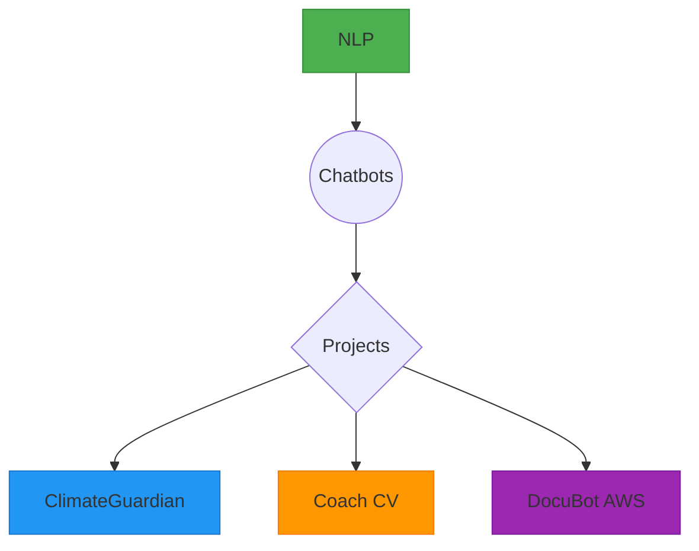

# Chatbot Projects Suite 🚀

**A repository of conversational AI solutions tailored to diverse domains**  
*Modular, production-ready platforms focusing on scalability and cost optimization.*

---

## 🌐 Overview

This repository consolidates three advanced chatbot projects that leverage modern NLP techniques, document management, and contextual analysis. Each solution is designed for specific domains with optimized architectures:

| **Project** | **Domain**          | **Primary Stack**          | **Status**      |
|-------------|---------------------|----------------------------|-----------------|
| [ClimateGuardian](https://github.com/ngo-modernedge/platform) | Environmental       | Python/Docker/PostGIS      | Production      |
| [Coach CV](https://github.com/usuario/coach-cv)               | Human Resources     | React/Flask/spaCy          | Beta            |
| [DocuBot AWS](https://github.com/usuario/docubot-aws)         | Technical Support   | LangChain/FAISS/OpenAI      | MVP             |

---

## 🛠️ Core Technologies



### Common Stack:
- **Language Processing**: spaCy, NLTK, Transformers.
- **Vector Storage**: FAISS, ChromaDB.
- **Frameworks**: LangChain, Rasa.
- **Infrastructure**: Docker, AWS Lambda, Redis.

---

## 🔍 Project Details

### 1. ClimateGuardian 🌍
**Solution for Environmental NGOs**
- **Purpose**: Climate monitoring + organizational collaboration.

#### Key Features:
- **Interactive Dashboard**: Real-time climate data visualization.
- **Automated Alerts**: Based on configurable thresholds.
- **IoT Integration**: Connects with environmental sensors.

#### Commands to Run:
```bash
docker-compose build && docker-compose up -d
```

---

### 2. Coach CV 📄
**Intelligent Resume Optimizer**
- **Purpose**: Analyze resumes and provide personalized recommendations.

#### Key Features:
- **Industry Keyword Detection**: Identifies relevant terms by domain.
- **Structural Analysis**: Highlights areas for improvement using AI.
- **Actionable Suggestions**: Generates quantifiable recommendations.

#### Commands to Run:
```bash
npm install && flask run
```

---

### 3. DocuBot AWS 🤖
**Technical Support Assistant for AWS**
- **Purpose**: 24/7 support + evolving knowledge base.

#### Key Features:
- **RAG (Retrieval-Augmented Generation)**: Combines search and generation for intelligent responses.
- **Multi-Level Cache**: Utilizes Redis and Memcached for fast retrieval.
- **AWS Console Integration**: Assists directly with AWS services.

#### Commands to Run:
```bash
pip install -r requirements.txt && python setup_rag.py
```

---

## 🚀 Quick Start

### Minimum Requirements:
```yaml
hardware:
  cpu: 4 cores
  ram: 8GB
  storage: 40GB SSD

software:
  docker: 20.10+
  python: 3.9+
  node: 16.x
```

### Initial Setup Steps:

1. **Clone the repository**:
   ```bash
   git clone https://github.com/fdaniel-alvarez-dev/chatbot-suite.git
   ```

2. **Set up the environment**:
   ```bash
   cd chatbot-suite && make install-dependencies
   ```

3. **Start base services**:
   ```bash
   docker-compose up -d postgres redis
   ```

---

## 📄 License

Licensed under the MIT License. See the [LICENSE](./LICENSE) file for more details.

---

## 🤝 Contribution

Contributions are welcome! Follow these steps:

1. **Fork the repository**.
2. **Create a feature branch**:
   ```bash
   git checkout -b feature/new-feature
   ```
3. **Commit your changes**:
   ```bash
   git commit -am "Add amazing feature"
   ```
4. **Push to the branch**:
   ```bash
   git push origin feature/new-feature
   ```
5. **Open a Pull Request**.

---
